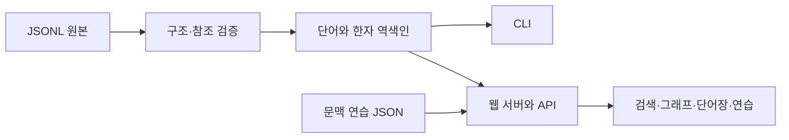

# 개발 안내

[프로젝트 소개·빠른 시작](../README.md) · [프로젝트 현황](README.md) · [웹 앱 사용 안내](WEB_APP.md) · [데이터 모델](DATA_MODEL.md)

## 개발 환경

- Go 1.26.2 이상: 서버, CLI, Go 테스트 실행
- Node.js: JavaScript 테스트 실행 시 사용
- 브라우저: 웹 앱 사용 및 화면 점검

Go 모듈은 `src`에 있다. 외부 Go 라이브러리나 프런트엔드 패키지를 설치할 필요가 없으며, HTML·CSS·JavaScript는 빌드할 때 Go 바이너리에 포함된다.

아래 명령은 별도 표시가 없으면 **`src` 디렉터리에서** 실행한다.

## 실행과 CLI

```sh
go run ./cmd serve
go run ./cmd -addr 127.0.0.1:8081 serve
go run ./cmd -data ../dataset -json validate
go run ./cmd word 가격
go run ./cmd character 家
go run ./cmd character 가
go run ./cmd character ga-005
go run ./cmd -json word 번화가
```

| 명령·옵션 | 동작 |
| --- | --- |
| `validate` | 세 JSONL 파일 검증 후 데이터·그래프 수치 출력; 명령 생략 시 기본값 |
| `word QUERY` | 한글 또는 한자 표기가 정확히 일치하는 단어 조회 |
| `character QUERY` | 글자, 한글 독음 또는 한자 ID가 정확히 일치하는 항목 조회 |
| `serve` | 웹 서버 실행; `Ctrl+C`로 종료 |
| `-data DIR` | 실행 디렉터리 기준 데이터 경로; 기본값 `../dataset` |
| `-json` | 검증·조회 결과를 JSON으로 출력; `serve`와 함께 사용할 수 없음 |
| `-addr HOST:PORT` | 서버 수신 주소; 기본값 `0.0.0.0:18080` |

옵션은 명령보다 앞에 둔다. 조회 결과가 없으면 성공 상태를 유지하며, JSON 출력은 `[]`다. 종료 코드는 성공 `0`, 데이터·서버·출력 오류 `1`, 잘못된 명령·옵션 `2`다.

기본 서버에는 같은 컴퓨터에서 `http://127.0.0.1:18080`으로 접속한다. 로컬 접속만 받으려면 `-addr 127.0.0.1:18080`을 지정한다.

### 바이너리 빌드

Linux·macOS 등에서는 다음처럼 빌드한 실행 파일을 재사용할 수 있다.

```sh
go build -o /tmp/han-graph ./cmd
/tmp/han-graph serve
```

Windows PowerShell에서는 다음과 같이 실행한다.

```powershell
go build -o "$env:TEMP\han-graph.exe" ./cmd
& "$env:TEMP\han-graph.exe" serve
```

데이터 경로는 바이너리 위치가 아닌 **실행 디렉터리**를 기준으로 한다. 다른 디렉터리에서 실행할 때는 `-data`로 경로를 지정한다.

서버는 시작할 때 JSONL과 `practice.json`을 검증해 메모리에 읽는다. 데이터 변경은 서버를 재시작해야 반영된다. 화면 소스를 바꿨다면 다시 빌드하거나 `go run`을 다시 실행한 뒤 브라우저를 새로고침한다. `validate`와 CLI 조회는 `practice.json`을 읽지 않는다.

## 소스 구조

| 경로 | 역할 |
| --- | --- |
| [cmd/main.go](../src/cmd/main.go) | CLI 옵션과 명령 처리 |
| [cmd/serve.go](../src/cmd/serve.go) | 서버 시작·종료, 연습 파일 로딩 |
| [graph/dataset.go](../src/internal/graph/dataset.go) | JSONL 파싱·검증과 역색인 생성 |
| [graph/graph.go](../src/internal/graph/graph.go) | 정확 일치·부분 검색, 무작위 선택, 통계 |
| [graph/neighborhood.go](../src/internal/graph/neighborhood.go) | 선택 항목의 직접 연결 그래프 구성 |
| [webapp/server.go](../src/internal/webapp/server.go) | 읽기 전용 API, 정적 파일, 초기 화면 데이터 |
| [webapp/practice.go](../src/internal/webapp/practice.go) | 문항 구조와 단어 참조 검증 |
| [static/app.js](../src/internal/webapp/static/app.js) | 화면 표시, 탐색과 브라우저 상태 |
| [static/data-client.mjs](../src/internal/webapp/static/data-client.mjs) | 조회 캐시와 중복 요청 공유 |
| [static/network.mjs](../src/internal/webapp/static/network.mjs) | 그래프 배치와 SVG 생성 |
| [static/network-routing.mjs](../src/internal/webapp/static/network-routing.mjs) | 상자를 피하는 연결선 경로 계산 |
| [static/network-view.mjs](../src/internal/webapp/static/network-view.mjs) | 그래프 이동과 포인터·키보드 조작 |
| [static/learning.mjs](../src/internal/webapp/static/learning.mjs) | 항목 식별, 단어장 정규화, 채점 |
| [static/wordbook.mjs](../src/internal/webapp/static/wordbook.mjs) | 단어장 JSONL 파싱·병합·출력 |



한자와 단어의 식별·연결 규칙은 [데이터 모델](DATA_MODEL.md#그래프와-조회)을 따른다. 화면 조작과 파일 가져오기 규칙은 [웹 앱 사용 안내](WEB_APP.md)에 정리한다.

## HTTP API

응답은 JSON이며 API 응답에는 `Cache-Control: no-store`를 사용한다.

| 경로 | 입력 | 응답 |
| --- | --- | --- |
| `GET /api/stats` | 없음 | 음 그룹·독음·고유 한자·단어·연결 수치 |
| `GET /api/search` | 선택적 `q` | `words`, `characters`, `word_count`, `character_count` |
| `GET /api/words` | 필수 `q` | 정확히 일치하는 단어와 구성 한자의 독음 후보 배열 |
| `GET /api/characters` | 필수 `q` | 글자·독음·ID에 정확히 일치하는 독음 레코드와 연결 단어 배열 |
| `GET /api/neighborhood` | 필수 `q` | `roots`, `characters`, `words`로 구성된 깊이 1 그래프 |
| `GET /api/random-word` | 선택적 `exclude_word`, `exclude_hanja` | 전체 데이터에서 선택한 단어 객체 하나 |
| `GET /api/practice` | 없음 | 문항, 선택지, 정답과 해설 |

### 조회 규칙

- `q`는 앞뒤 공백을 제거한 뒤 최대 100개 유니코드 문자까지 받는다. 필수 검색어가 비었거나 길이를 초과하면 `400`이다.
- 부분 검색은 영문 대소문자를 구별하지 않는다. 단어·한자 결과는 종류별 최대 60개이며, 개수 필드는 제한 전 전체 일치 수다. 빈 검색어는 각 목록의 처음 항목들을 반환한다.
- 정확 일치 조회 결과가 없으면 `[]`다. 그래프 결과가 없으면 세 배열이 모두 비어 있다.
- 그래프는 단어 조회를 먼저 시도하고, 일치하는 단어가 없으면 글자·독음·ID 조회로 시작점을 정한다. 한글 동음이의어로 조회하면 일치한 여러 단어의 구성 한자가 함께 시작점이 될 수 있다. 웹 앱은 선택 단어의 한자 표기로 요청한다.
- 무작위 선택은 다른 항목이 있을 때 정확한 `(exclude_word, exclude_hanja)` 쌍을 제외한다. 제외 필드는 각각 최대 100개 유니코드 문자이며, 데이터가 비어 있으면 `404`다.
- 없는 경로는 `404`, 지원 경로에 허용하지 않은 HTTP 메서드를 사용하면 `405`다.

문맥 연습 API는 정답과 해설도 브라우저에 전달한다. 채점은 브라우저에서 수행하는 자율 학습 기능이다.

## 초기 로딩과 저장

서버는 통계·초기 검색·연습 세트·기본 선택 단어와 그래프를 시작 시 준비해 HTML의 JSON 블록에 담는다. 기본 화면은 추가 API 요청 없이 열리고, 다른 단어의 상세 정보는 API로 조회한다. 전체 단어 상세를 HTML에 싣지는 않는다.

브라우저 조회 캐시는 현재 페이지에서 최대 128개 요청 결과를 유지하고, 진행 중인 동일 요청을 공유한다. 실패한 요청은 캐시에서 제거해 다시 시도할 수 있으며 새로고침하면 캐시가 초기화된다. 무작위 단어 선택은 이 캐시를 사용하지 않는다.

정적 파일과 초기 HTML에는 내용 해시를 ETag로 제공한다. 변경이 없으면 재검증 요청에 `304`를 반환하며, 파일별 Content-Type을 명시한다. HTML에 포함하는 JSON은 HTML 구분 문자를 이스케이프한다. 화면은 외부 CDN·폰트·분석 서비스에 의존하지 않는다.

브라우저의 `localStorage` 키는 다음과 같다.

| 키 | 내용 |
| --- | --- |
| `han-graph.words.v1` | 저장한 `(word, hanja)` 쌍, 최대 500개 |
| `han-graph.language` | 한국어·영어 선택 |
| `han-graph.practice.v1` | 마지막 완료 연습의 정답 수·문항 수·완료 시각 |

단어장 파일의 문자열 길이는 JavaScript의 문자열 길이(UTF-16 코드 단위)로 검사한다. HTTP API의 유니코드 문자 수 제한과는 계산 방식이 다르다.

## 검증

데이터만 바꾼 경우에는 다음 검사를 실행한다. 상세 JavaScript·브라우저·전체 웹 테스트는 데이터 검증 루틴에 포함하지 않는다.

```sh
go run ./cmd validate
go test -count=1 ./...
go vet ./...
```

| 검사 | 주요 범위 |
| --- | --- |
| 데이터 검증 CLI | 세 JSONL 파일의 형식·중복·참조와 그래프 수치 |
| Go 테스트 | 조회·무작위 선택·그래프 범위, 연습 참조, 표제어·독음 회귀, API·초기 HTML·캐시 헤더 |
| JavaScript 테스트 | 웹 코드를 바꾼 경우에만 관련 테스트 파일을 선별해 조회 캐시, 단어장, 채점, 그래프 동작을 확인 |
| 브라우저 확인 | 웹 화면을 바꾼 경우에만 수정한 핵심 흐름을 짧게 확인 |

웹 코드를 수정했을 때도 변경 기능에 해당하는 테스트 파일만 선별한다. 예를 들어 데이터 조회 클라이언트만 바꿨다면 다음 한 파일을 실행한다. 전체 테스트 디렉터리 실행, 모든 단어의 그래프 배치 전수 검사, 여러 화면 너비의 상세 수동 점검은 기본 루틴에서 제외한다.

```sh
node --test internal/webapp/tests/data-client.test.mjs
```

### Windows 테스트 경로 오류

제한된 파일 권한 때문에 Node가 상위 경로를 확인하다 `lstat` 오류를 내는 환경에서는 다음 옵션을 사용한다.

```sh
node --preserve-symlinks --preserve-symlinks-main --test internal/webapp/tests/data-client.test.mjs
```
